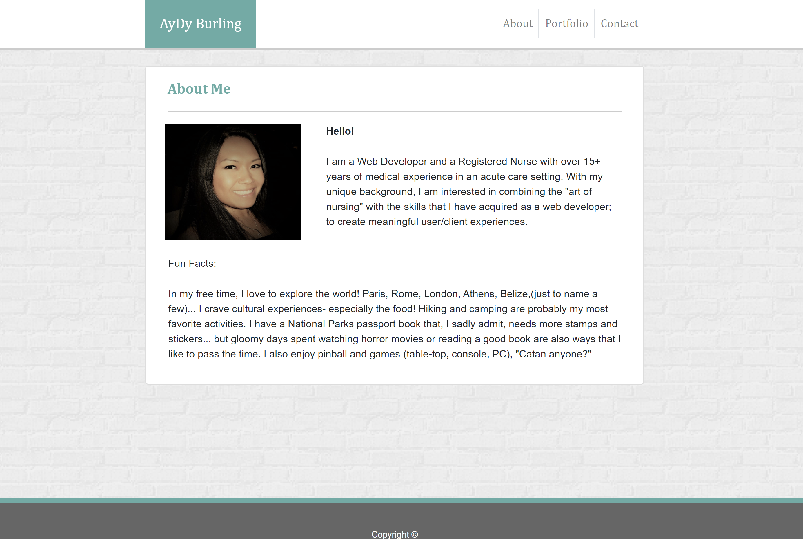
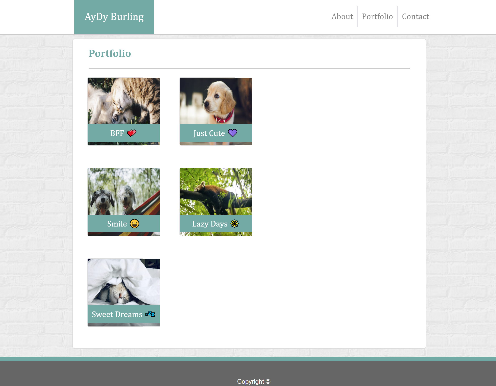
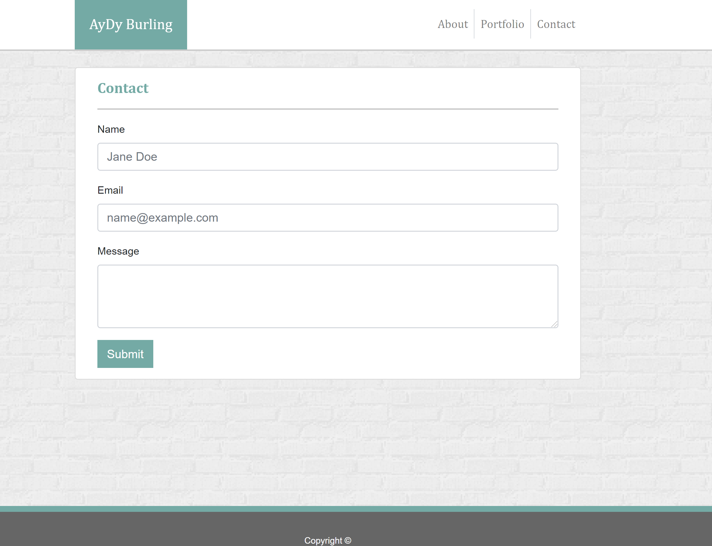
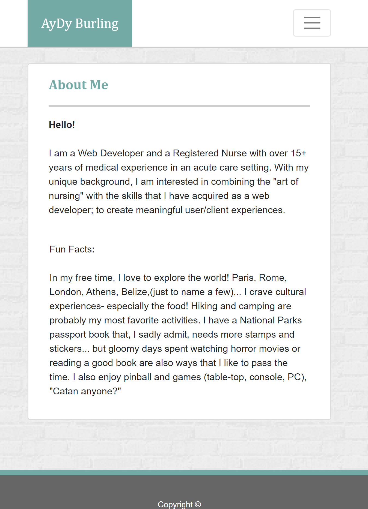
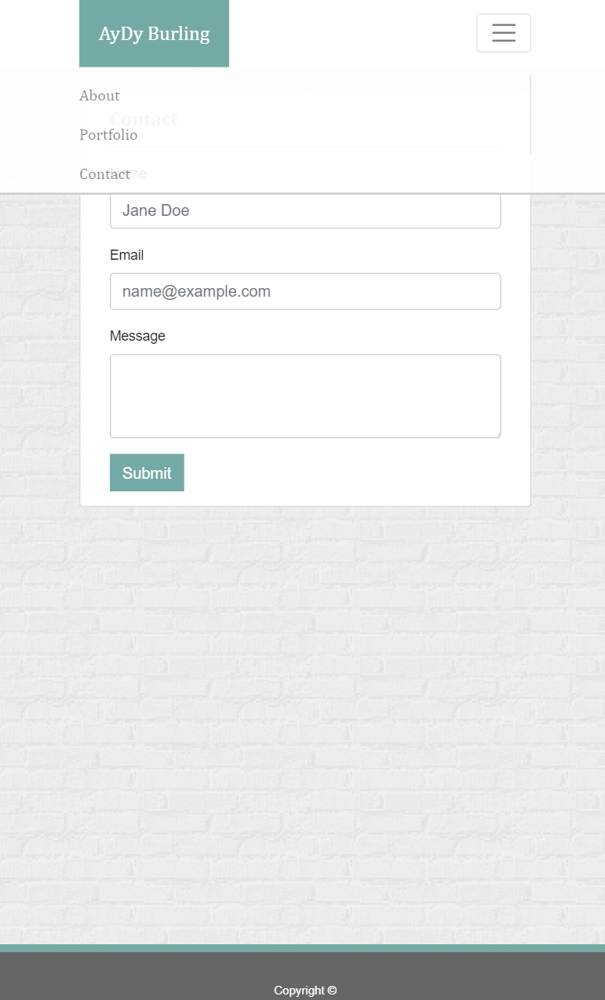

# Portfolio with Bootstrap

Live Site: <https://dee1985.github.io/portfolio-bootstrap/>

Description and Usage: Utilizing Bootstrap features (i.e grid layout, components, responsive design, etc...), this site is a mock representation of a basic portfolio and can be used as a template.

Instructions: Click links in the navbar to view 3 different pages (About Me, Portfolio, Contact).

About Me: 

- Brief snapshot of my professional background and section mentioning my favorite things to do.

Portfolio-Gallery: 

- Photo gallery displaying images of animals. Functionality was not indicated in the project instructions (at this time)

Contact: 

Mobile view: 

Navbar Mobile view: 

Installation: No installation required.

Contributions: A lot of Google Fu!

Challenges: Letting Bootstrap do the work and realizing that I was complicating certain issues by attempting to use CSS instead of referring to Bootstrap documentation.

Successes: The site is responsive.

Future Plans: As I am becoming comfortable with flexbox and Bootstrap, I would redo this assignment with less CSS.
